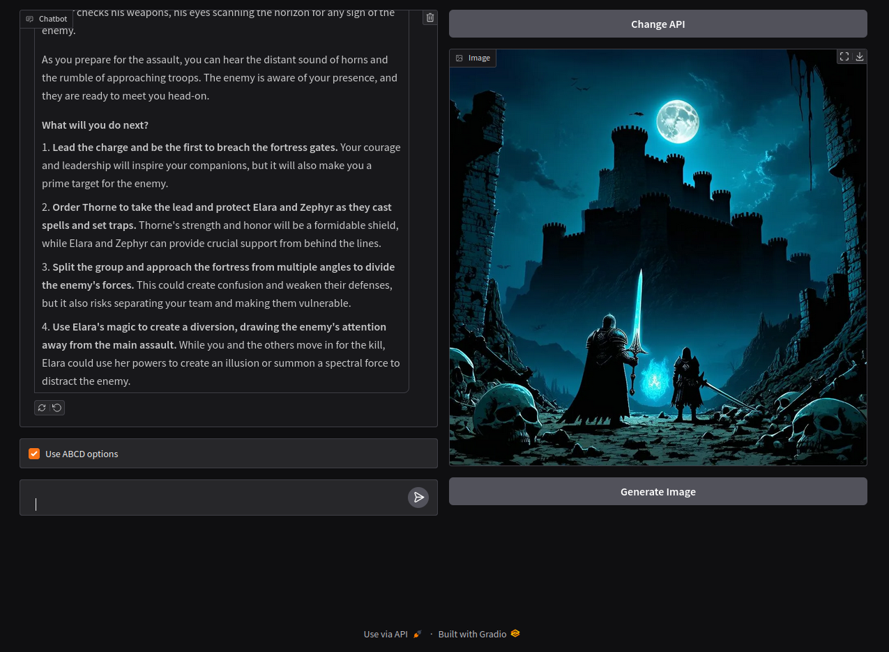
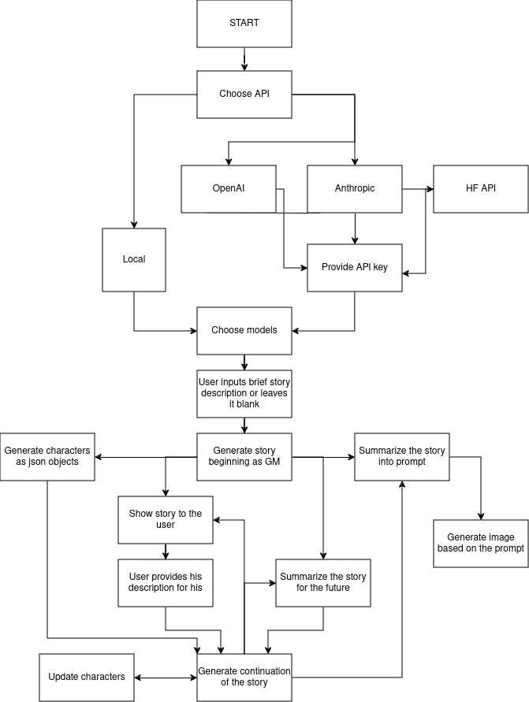

# AgenticRPG
This is an interactive RPG game based on agentic flow of transformer models.

# Process of making the app
Okay, this app has been created to test out agentic possibilities of models in storytelling, text generation, image generation, summarization, prompting etc.
At first the models supposed to be used locally, and then integration with API was supposed to be added, but for a quickstart due to the processing time and VRAM restraints it was done with huggingface api.
The pipeline at first was text generations with pipelines, but then after discovering agents in tranformers library it was changed to them to test it and learn something new.
Currently the agent fail a lot. Works only once in a few tries. It migh be due to the fact that only small models are used, but nethertheless it needs to be fixed. 
# TODO
- Fix the agents generating bad code 
- add integration of local models 
- add integration of different APIs 
- add UI 

# Image generated for the beginning of the story with model stabilityai/stable-diffusion-xl-base-1.0:

# Flow of the app
